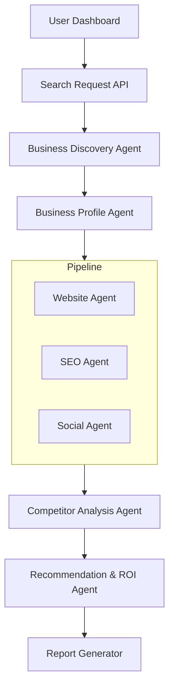

<div align="center">
  <h1>🚀 Low2High</h1>
  <p><strong>AI-Powered Business Discovery & Digital Transformation Platform</strong></p>

  <p>
    
    
    
    
    
  </p>
</div>

---

## 📖 About The Project

**Low2High** is an AI Digital Consultant platform designed for Small and Medium Businesses (SMBs). 

It automates the grueling task of finding businesses with weak digital footprints, evaluating their digital maturity, benchmarking them against competitors, and generating highly actionable digital transformation roadmaps. By leveraging advanced orchestration with **LangGraph** and **LangChain**, it effectively acts as a tireless, fully autonomous digital agency.

### Why Low2High?
Many SMBs miss out on revenue due to poor online presence. Digital agencies spend countless hours manually finding these leads, auditing their websites, and pitching solutions. Low2High completely automates this lifecycle—from discovery to the final PDF audit report.

## ✨ Key Features

- 🔍 **Automated Business Discovery**: Find local businesses missing critical online infrastructure using Google Maps and web scraping.
- 📊 **Deep Digital Auditing**: Multi-agent pipelines independently review websites, SEO metrics, social media presence, and local competition.
- 🧠 **AI-Driven Strategy Engine**: Synthesizes raw data into a concrete **Digital Maturity Score** and tailored ROI strategies.
- 📄 **Automated PDF Reports**: Generates professional, client-ready transformation roadmaps.
- 🎯 **Lead Generation Pipeline**: Seamlessly feed qualified, pre-audited leads into CRMs for digital agencies.

## 🛠️ Tech Stack

- **Backend / API**: FastAPI, Uvicorn
- **Frontend / UI**: Streamlit
- **AI & Orchestration**: LangGraph, LangChain, OpenAI
- **Data & Storage**: SQLite, SQLAlchemy, aiosqlite
- **Scraping & Automation**: Playwright, BeautifulSoup4

---

## 🏗️ Architecture & System Workflow

The architecture relies on a pipeline of specialized AI Agents to perform comprehensive business audits.

### Component Flow



### Data Flow Breakdown
1. **Discovery Phase**: The `Discovery Agent` uses Maps and search APIs to crawl and identify SMBs missing strong digital presence.
2. **Profile Generation**: The `Profile Agent` compiles raw baseline data into the SQLite Database.
3. **Audit Pipeline**: Specialized agents (Website, SEO, Social) independently analyze the business's online footprint and save metrics.
4. **Competitor Benchmarking**: The `Competitor Agent` evaluates the business against local competitors to identify market gaps.
5. **Strategy & Reporting**: The `Recommendation Agent` synthesizes all metrics to produce a Digital Maturity Score and actionable ROI strategies. Finally, the `Report Generator` creates a PDF Report for the client/user.

---

## 📸 Screenshots

*(Replace placeholders with actual screenshots of your application!)*

| Dashboard Overview | Detailed Audit Report |
| :---: | :---: |
|  |  |

---

## 🚀 Getting Started

To get a local copy up and running, follow our detailed setup guide.

### Prerequisites & Installation

Please refer to our **[Setup Guide](SETUP.md)** for complete step-by-step instructions on installing dependencies, setting up environment variables, and initializing the database.

### Quick Run

```bash
# 1. Start the API
uvicorn src.low2high.main:app --reload

# 2. Start the UI (in a new terminal)
streamlit run src/low2high/app.py
```

## 📚 Documentation

Extensive engineering and architectural documentation can be found in the [`docs/`](docs/) directory:
- [System Overview](docs/architecture/system-overview.md)
- [Agent Architecture](docs/agents/manager-agent.md)
- [API Design](docs/api/endpoints.md)
- [Digital Maturity Score](docs/scoring/digital-score.md)
- [Development Rules](docs/implementation/coding-rules.md)

## 🤝 Contributing

Contributions are what make the open-source community such an amazing place to learn, inspire, and create. Any contributions you make are **greatly appreciated**.

Please see our [CONTRIBUTING.md](CONTRIBUTING.md) for details on how to submit pull requests, report issues, and suggest features.

## 📄 License

Distributed under the MIT License. See `LICENSE` for more information.

---

## 📫 Contact Us

*Note: This repository contains our backend agentic orchestration engine. Our primary business website operates separately.*

Have questions, want a demo, or need direct digital transformation services? Reach out to our agency directly!

**🌐 Visit our Agency Website:** [low2high.online](https://low2high.online)
