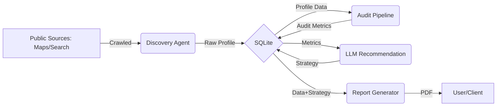

# Data Flow

```mermaid
flowchart LR
    A[Public Sources: Maps/Search] -->|Crawled| B(Discovery Agent)
    B -->|Raw Profile| C{SQLite}
    C -->|Profile Data| D(Audit Pipeline)
    D -->|Audit Metrics| C
    C -->|Metrics| E(LLM Recommendation)
    E -->|Strategy| C
    C -->|Data+Strategy| F(Report Generator)
    F -->|PDF| G[User/Client]
```
