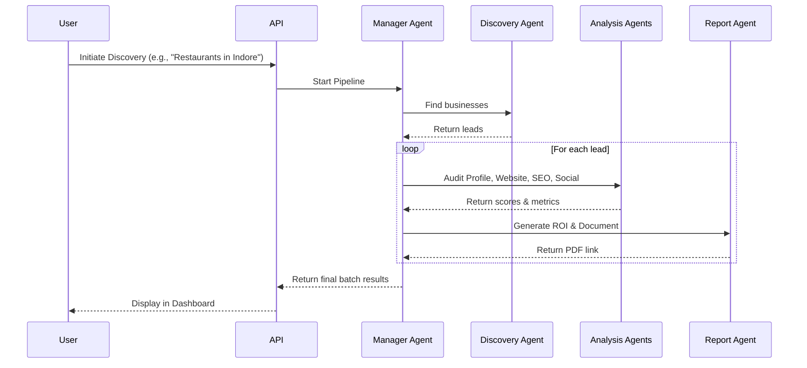

# Sequence Diagrams

## Core Workflow

```mermaid
sequenceDiagram
    participant User
    participant API
    participant Manager as Manager Agent
    participant Discovery as Discovery Agent
    participant Analysis as Analysis Agents
    participant Report as Report Agent
    
    User->>API: Initiate Discovery (e.g., "Restaurants in Indore")
    API->>Manager: Start Pipeline
    Manager->>Discovery: Find businesses
    Discovery-->>Manager: Return leads
    
    loop For each lead
        Manager->>Analysis: Audit Profile, Website, SEO, Social
        Analysis-->>Manager: Return scores & metrics
        Manager->>Report: Generate ROI & Document
        Report-->>Manager: Return PDF link
    end
    
    Manager-->>API: Return final batch results
    API-->>User: Display in Dashboard
```
